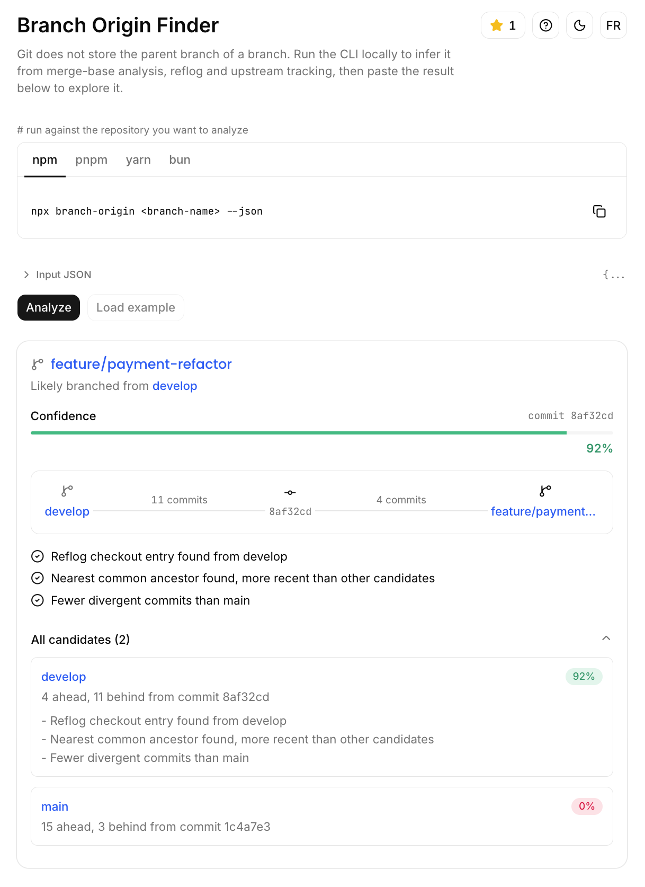
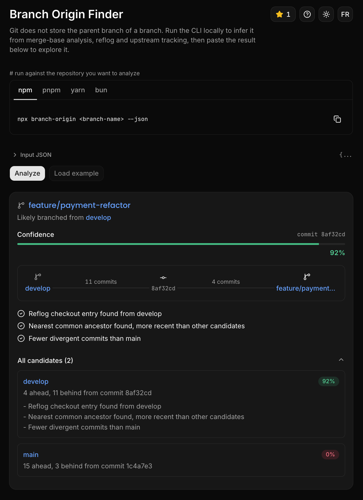
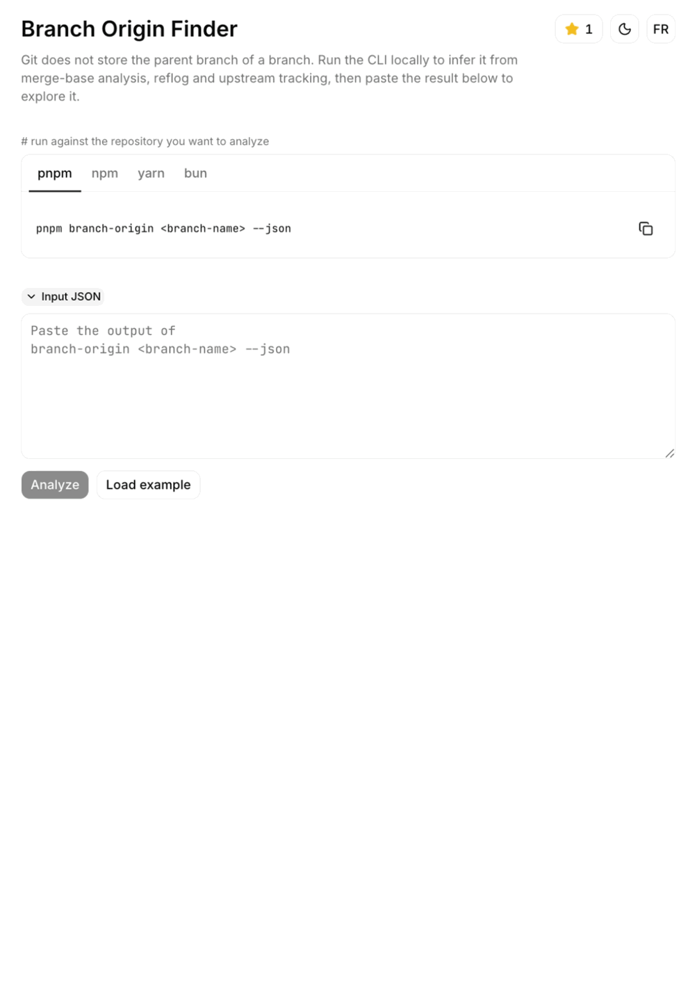

# Branch Origin Finder

## Why this exists

Git does not store the parent branch of a branch. When a developer creates `feature/payment-refactor`, Git never records whether it came from `main`, `develop` or `release/2.1`. This tool infers the most likely parent branch from the commit history instead of guessing.

It is not a tutorial project. It solves a real developer tooling problem, using merge-base analysis, reflog inspection and upstream tracking to produce a confidence score, not an absolute answer. Git does not guarantee ground truth here, so the tool never claims to.

## Features

- CLI command `branch-origin <branch-name>` with a confidence score, defaulting to the current branch when none is given
- `--all` flag to analyze every local branch against the others in one pass
- `--json` flag for structured output
- `-C <path>` flag to run against a repository other than the current directory
- Works with npm, yarn, bun and pnpm: the CLI compiles to plain JS (`pnpm build:cli`) and exposes a `bin` entry, it does not assume any single package manager
- Merge-base analysis, ranked by recency in the commit graph (not just by commit date, which can tie or be rewritten by a rebase)
- Reflog inspection for local `checkout` entries and branch creation records (local only)
- Upstream tracking via `branch.<name>.merge`
- Candidate branches are not hardcoded to `main`/`master`: the remote's actual default branch (`origin/HEAD`) is detected and always included, whatever it is named
- A topology check that rules out a candidate when the target branch is provably older than it, instead of reporting a confident but nonsensical match
- Web interface: paste a `--json` result to visualize the branch graph, confidence score and reasons, no server-side git access involved
- The confidence bar and percentage count up together, color-coded by tier (high / medium / low)
- French/English language toggle
- Light/dark theme toggle (with interaction sounds)

Example output:

```text
Branch: feature/payment-refactor

Likely source branch : develop (95%)
Branch point         : commit 4d0acce
Reasons              :
  Reflog checkout entry found from develop
  Nearest common ancestor found, more recent than other candidates
  Fewer divergent commits than main
```

## Tech stack

- Next.js (App Router)
- Node.js / CLI core (`commander`, `simple-git`, compiled with `tsup`)
- Tailwind CSS + Shadcn UI (web interface)
- next-themes (dark/light mode)
- cuelume (interaction sounds)
- pnpm (repo tooling), npm/yarn/bun all work for running the built CLI

## Screenshots / Demo GIF

Light mode:



Dark mode:



Pasting a CLI result, exploring the confidence breakdown, and toggling theme/language:



## How to reuse

1. Clone the repo and install dependencies: `pnpm install`
2. During development, run the CLI directly with `pnpm branch-origin <branch-name> -C /path/to/repo`, or `--json` for structured output, or `--all` to check every branch at once
3. To use it like an installed tool regardless of package manager, build it once with `pnpm build:cli` (outputs `dist/cli.mjs`), then run it with `npm run branch-origin -- <branch-name> --json`, `yarn branch-origin <branch-name> --json` or `bun run branch-origin <branch-name> --json`
4. Start the web interface with `pnpm dev`, then paste a `--json` result (or click "Load example") to visualize it

## Architecture

- `lib/git/infer-origin.ts` is the entry point of the analysis: it resolves candidate branches, gathers signals for each, and scores them
- `lib/git/branches.ts` resolves candidates: it reads `origin/HEAD` to find the real default branch whatever it is named, falls back to common integration branch names (`main`, `master`, `develop`, `release/*`), and falls back again to every other local branch if none match
- `lib/git/merge-base.ts`, `lib/git/reflog.ts` and `lib/git/upstream.ts` each read one independent signal from the repository (merge-base and divergence, reflog checkout entries, upstream tracking config)
- `lib/git/ancestry.ts` ranks merge-base commits by actual position in the commit graph rather than trusting commit timestamps alone; it shells out directly with `child_process` because `simple-git`'s `raw()` does not reliably surface a non-zero exit code when a command like `merge-base --is-ancestor` produces no stderr output
- `lib/git/confidence.ts` turns the gathered signals into a weighted score and a list of reasons, and filters out candidates the commit graph proves cannot be the source
- `bin/branch-origin.ts` is the CLI entry point (`commander`), calling the same `lib/git` core used by the web interface; `tsup.config.ts` compiles it to `dist/cli.mjs` so it runs under plain Node regardless of package manager
- `lib/git/types.ts` defines `ConfidenceReason` as a `code` plus structured `params`, so both the English CLI output and the localized web UI can render the same reason from the same data
- `lib/git/validate.ts` is a small runtime type guard for JSON pasted into the web interface, so malformed input fails with a readable error instead of a crash
- `components/git/` holds the web interface: `json-input-form.tsx` (paste + parse), `origin-result-card.tsx` (score, reasons, candidate breakdown), `branch-graph.tsx` (the divergence diagram), `confidence-bar.tsx` (color-coded, animated via `lib/hooks/use-count-up.ts`) and `cli-command.tsx` (the pnpm/npm/yarn/bun command picker with copy-to-clipboard)
- `lib/i18n/` holds `en.json`/`fr.json` dictionaries; `localizeReason()` re-renders a `ConfidenceReason` in the active locale
- `lib/github.ts` reads the repo's live star count from the GitHub API (revalidated every 5 minutes) for the header's "star this repo" button
